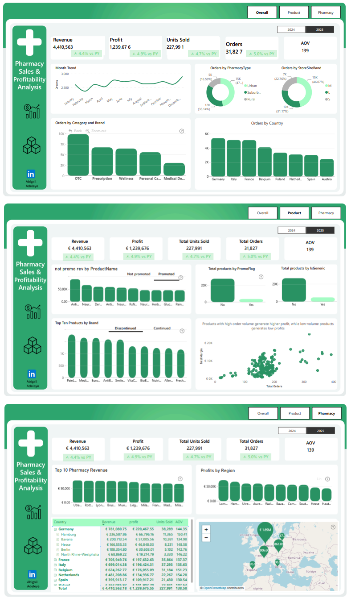

# Pharmacy-Sales-And-Profitability-Analysis
## Project Overview
This project analyzes sales and profitability data for a European pharmacy chain distributor operating across multiple countries. The objective of the project is to build an interactive Power BI dashboard that enables stakeholders to understand business performance across countries, regions, and individual pharmacies. The analysis focuses on revenue, units sold, and profit margin, as well as how different product categories and brands perform across locations.
### Problem Statement 
The pharmacy distributor operates across multiple European countries with numerous pharmacies and a broad product portfolio. Although transactional sales data is available, stakeholders lack a unified and interactive view of performance across geographic and product dimensions.
Key challenges include:
-	Monitoring how revenue, units sold, and profit margin change over time.
-	Comparing performance across countries, regions, and individual pharmacies.
-	Understanding how product categories and brands perform in different locations.
-	Identifying underperforming pharmacies and high-performing ones within the same region.
-	Evaluating the impact of promotions on sales volume and profitability.
-	Determining how regional performance contributes to overall business results.
### Business Questions Answered
The dashboard was designed to answer the following key business questions:
-	How do revenue, units sold, and margin change over time, and are there clear seasonal patterns?
-	Which countries and regions contribute the most to total revenue and profit margin?
-	How does performance vary when drilling down from country → region → pharmacy?
-	Which pharmacies outperform or underperform compared to others in the same region?
-	How do Urban, Suburban, and Rural pharmacies differ in sales volume and profitability?
-	Which product categories and brands generate the most revenue, and which generate the most profit?
-	Are there products with high volume but low margin, or low volume but high margin?
-	How do promoted sales compare to non-promoted sales in terms of volume and margin?
### Tools and Methodology
#### Tools Used:
-	Power BI Desktop – for data modeling, analysis, and visualization
-	DAX – for calculating KPIs such as revenue, profit margin, and year-over-year metrics
-	Power Query – for data cleaning and transformation
-	PowerPoint – for wireframing and layout planning
#### Methodology:
-	Data Modelling: Defined relationships between fact and dimension tables to enable accurate filtering, drill-down analysis, and efficient querying.
-	Data Cleaning: Validated data types, handled missing values, and ensured consistency across key fields such as dates, geography, and product attributes.
-	Segmentation & Comparative Analysis: Analyzed performance by geography, pharmacy type, product category, brand, and promotion status to compare trends and identify differences in sales and profitability.
-	Visual Storytelling: Built an interactive dashboard using time-series charts, maps, bar charts, and scatter plots to highlight trends, comparisons, and performance drivers.

[Link_to_Report](https://app.powerbi.com/view?r=eyJrIjoiMGMzODNkMGEtMWU1Yi00OTIwLTg3NTYtMWYzNTZlN2NkMWZmIiwidCI6IjQ2NTRiNmYxLTBlNDctNDU3OS1hOGExLTAyZmU5ZDk0M2M3YiIsImMiOjl9)
### Key Insights
-	Revenue shows clear seasonality, with the highest revenue recorded in July and the lowest in February across the observed years. In 2025 specifically, May also recorded strong revenue performance, while February remained the weakest month.
-	Units sold peaked in December 2025, indicating a strong year-end demand. The lowest sales volume occurred in April, followed by February, suggesting weaker demand in early-year periods.
-	By product category and brand, Anti BioX generated the highest revenue across both years, while Medical Devices contributed the least to total revenue.
-	Germany was the top-performing country in terms of revenue and profit, while Austria generated the lowest revenue and profit in both 2024 and 2025.
-	Urban pharmacies generated higher revenue than Suburban and Rural pharmacies, with Rural pharmacies contributing the least.
-	At the product level, Anti BioX ACE Inhibitor 400mg generated the highest revenue, followed by NeuroMed Antidepressant 100mg and Demrxx Insulin Pen 200mg.
-	There is a strong positive relationship between order volume and revenue: products with higher order counts tend to generate higher revenue, confirming volume as a key revenue driver.

### Recommendations
-	Increase stock levels and staffing capacity ahead of peak months such as July and December.
-	Prioritize marketing and shelf space for top-performing brands such as Anti BioX and high-revenue products like ACE Inhibitor 400mg, as these are major contributors to overall revenue.
-	Investigate operational, pricing, or distribution challenges in underperforming countries such as Austria, and apply best practices from top-performing regions like Germany.
-	Expand or replicate the urban pharmacy and medium store size model, as it demonstrates the strongest performance in terms of orders, revenue, and profit.
-	Strengthen availability and promotions for top order-driving categories OTC, Prescription and Wellness to sustain volume growth.
-	Since higher order volume strongly drives revenue, targeted promotions should focus on high-demand products with acceptable margins rather than low-volume items
